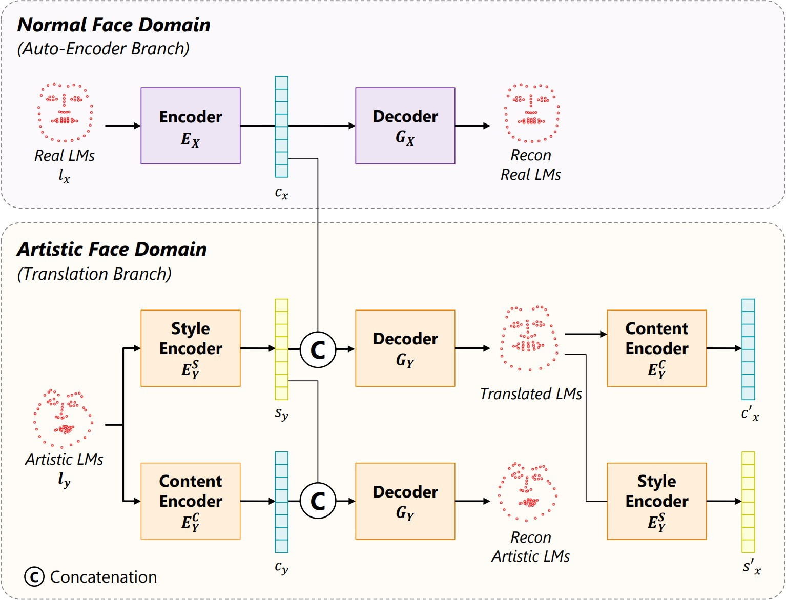

# Geometry Style Transfer

This is the implementation for the part of Geometry Style Transfer on landmarks for the paper "Exemplar Based 3D Portrait Stylization". Please refer to [our project page](https://halfjoe.github.io/projs/3DPS/index.html) and the code [3D-Portrait-Stylization](https://github.com/halfjoe/3D-Portrait-Stylization) for how this repo is organized.

## :star2: Pipeline



## :ok_hand: Updates 

2022/05/01: initial release.

## :point_right:Install

`Conda` with `python = 3.7`

`pytorch = 1.7`

An example environment setting can be found at `requirements.txt`

By default, our code is trained with a single GPU >= 2.5GB.

## :star2: Data and Preparation

Dataset for can be downloaded [here](https://portland-my.sharepoint.com/:u:/g/personal/shuquanye2-c_my_cityu_edu_hk/EUtHyW5r_C5OlBnzVL5Bs28BFVgy3KN_jtrBbL5Tfxrjew?e=GPB268)(1.2GB). It contains training sets trainA, trainB and trainC (content-style paired dataset) and testing set testA and testB. 

Please unzip and put them into `datasets/point/` in the main directory of the code.

And then, please download our pre-trained principal component analysis (PCA) weights [here](https://portland-my.sharepoint.com/:u:/g/personal/shuquanye2-c_my_cityu_edu_hk/EWECEJz-1N1FljiG9KXFwpQB6Wmeqv1mkS_OUuE6fjrDYA?e=c32fHP), and put it into the main directory of the code.

## Run

As descripted in the paper, we first train the autoencoder branch in stage1, and then fix it to train the translation branch in stage2.

We provide the example script for training and testing for both stages:

```bash
bash train_test.sh;
```

Also you can train stage1 with you own options by:

```
python train.py --dataroot your_datasets_path --model cycle_gan --no_dropout --niter 100 --niter_decay 100 --stage1 --name s1run --concat --batchSize your_batchsize --numPoints 68 --height 512 --width 512 --fineSize 304 --C_paths your_datasets_path
```

, and test stage1 with you own options and your test set by:

```
python test.py --dataroot your_datasets_path --model cycle_gan --no_dropout --stage1 --name s1run --concat --numPoints 68 --height 512 --width 512 --fineSize 512 --display_winsize 256
```

, and train stage2 with you own options by:

```
python train.py --dataroot your_datasets_path --model cycle_gan --no_dropout --niter 450 --niter_decay 350 --stage2 --concat --name s2run --load_name s1run --continue_train --batchSize your_batchsize --lr 0.0005 --numPoints 68 --DimClass 25 --height 512 --width 512 --fineSize 304 --classify --omega 1.0 0.5 0.1
```

, and test stage2 with you own options by:

```
python test.py --dataroot your_datasets_path --model cycle_gan --no_dropout --stage2 --concat --name s2run --load_name s1run --numPoints 68 --height 512 --width 512 --fineSize 512 --display_winsize 256 --classify --get_txt --phase test --how_many -1 --rescale 1.0 --share_EC_s1_s2
```

## BibTeX

```@ARTICLE{han2021exemplarbased,
author={Han, Fangzhou and Ye, Shuquan and He, Mingming and Chai, Menglei and Liao, Jing},  
journal={IEEE Transactions on Visualization and Computer Graphics},   
title={Exemplar-Based 3D Portrait Stylization},   
year={2021},  
doi={10.1109/TVCG.2021.3114308}}
```

## :smiley_cat: Acknowledgements 

We thank a lot for the flexible codebase of [CycleGAN](https://github.com/junyanz/pytorch-CycleGAN-and-pix2pix).